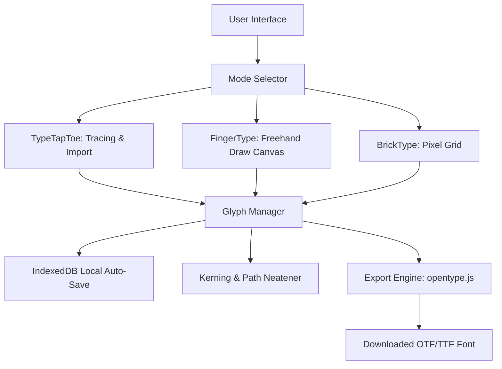

# 🎨 DrafType — Premium Custom Font Builder

<p align="center">
  
</p>

<p align="center">
  <i>Making custom fonts has never been this easy.</i>
</p>

<p align="center">
  <a href="https://draftype.woyo.workers.dev" target="_blank">
    
  </a>
  <a href="https://github.com/keliksa30/draftype/blob/main/LICENSE">
    
  </a>
  
</p>

---

**DrafType** is a premium, interactive, and user-friendly web application designed to help creators, designers, and developers craft custom typography directly in their browser. With support for image tracing, freehand canvas drawing, and retro pixel-grid drafting, DrafType provides a comprehensive suite of tools to create and export professional `.otf` and `.ttf` font files instantly.

## 🚀 Live Demo & Release

The application is deployed on Cloudflare Pages and is publicly accessible here:
👉 **[draftype.woyo.workers.dev](https://draftype.woyo.workers.dev)**

---

## 📌 Table of Contents

- [🚀 Key Features](#-key-features)
  - [1. 🔍 TypeTapToe Mode (Image & SVG Tracing)](#1--typetaptoe-mode-image--svg-tracing)
  - [2. ✍️ FingerType Mode (Freehand Drawing)](#2-️-fingertype-mode-freehand-drawing)
  - [3. 🧱 BrickType Mode (Retro & Pixel Art)](#3--bricktype-mode-retro--pixel-art)
  - [4. 🎛️ Utility & Playground Features](#4-️-utility--playground-features)
- [🛠️ System Architecture](#-system-architecture)
- [💻 Local Development](#-local-development)
  - [Prerequisites](#prerequisites)
  - [Getting Started](#getting-started)
- [📁 Tech Stack](#-tech-stack)
- [📜 Commands Reference](#-commands-reference)
- [📄 License](#-license)

---

## 🚀 Key Features

DrafType supports three unique creative modes designed to fit different design styles:

### 1. 🔍 TypeTapToe Mode (Image & SVG Tracing)
*   **Image Tracing:** Upload images/photos of letters, adjust threshold settings, and trace them into clean vector glyph paths.
*   **SVG Import:** Drag-and-drop raw SVG files to convert vector drawings directly into character paths.
*   **Font Editor:** Upload an existing `.ttf` or `.otf` font file to modify its characters and re-export.

### 2. ✍️ FingerType Mode (Freehand Drawing)
*   **Brush & Pen Tools:** Draw vector paths using smooth brush strokes or precise vector pen anchor points.
*   **Smoothness Controls:** Automatically neatens and smooths rough mouse or touchscreen paths.
*   **Path Customization:** Toggle between Calligraphy or Pointed pen styles, adjust brush size, and utilize reference backgrounds.
*   **Touchscreen-Optimized:** Fully optimized drawing canvas on iOS, Android, and tablet devices with pointer capture safety.

### 3. 🧱 BrickType Mode (Retro & Pixel Art)
*   **Grid Editor:** Easily design retro pixel fonts by placing blocks on an interactive grid.
*   **Mobile-Friendly Drag Drawing:** Draw and erase across grid blocks smoothly using drag gestures on mobile or tablet touchscreens.
*   **Grid Scaling:** Customize grid dimensions and block offsets.
*   **Autofill & Clear:** Powerful pixel manipulations for drawing symmetry.

### 4. 🎛️ Utility & Playground Features
*   **Kerning Pairs Editor:** Manually adjust the spacing between specific character combinations (e.g., "AV", "LT").
*   **Live Preview Specimen:** Test your font in a real-time text playground with sentence templates, line heights, and size controls.
*   **Auto-Save & Draft Backups:** Integrated IndexedDB support saves your work local to the browser so you never lose your progress.

---

## 🛠️ System Architecture

DrafType is built as a React-based client-side application running on Next.js/Vite (powered by the Vinext/Cloudflare ecosystem).



---

## 💻 Local Development

### Prerequisites
*   Node.js `>= 22.13.0`
*   `npm` or `pnpm` package manager

### Getting Started

1.  **Clone the Repository:**
    ```bash
    git clone https://github.com/keliksa30/draftype.git
    cd draftype
    ```

2.  **Install Dependencies:**
    ```bash
    npm install
    # or
    pnpm install
    ```

3.  **Start the Local Dev Server:**
    ```bash
    npm run dev
    # or
    pnpm dev
    ```
    Open `http://localhost:3000` or the terminal-indicated port to run the app.

4.  **Production Build:**
    ```bash
    npm run build
    ```

---

## 📁 Tech Stack

*   **Frontend Core:** React 19, TypeScript, Next.js, HTML5 Canvas
*   **Styling:** Vanilla CSS (including custom premium dark mode themes)
*   **Local Storage:** IndexedDB (via custom hooks)
*   **Font Generation:** `opentype.js` (for parsing, manipulating, and writing OTF/TTF binaries)
*   **Hosting/Backend Platform:** Cloudflare Pages with Vinext full-stack bindings

---

## 📜 Commands Reference

*   `npm run dev` - Starts the development server.
*   `npm run build` - Validates the Vinext production build.
*   `npm test` - Runs test suites.
*   `npm run db:generate` - Generates Drizzle migrations for DB schemas if Cloudflare D1 integration is enabled.

---

## 📄 License

This project is licensed under the MIT License - see the [LICENSE](LICENSE) file for details.

---

*Crafted with 🖤 by [keliksa30](https://github.com/keliksa30).*
